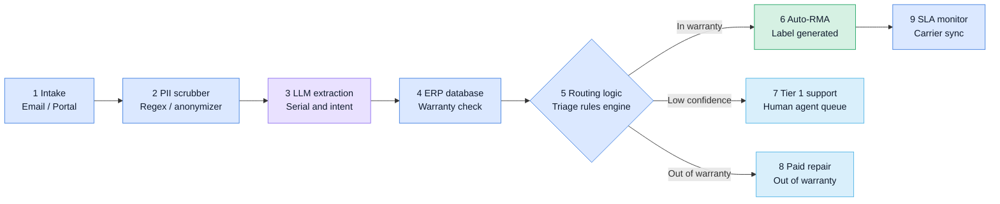

# RMA Triage

Warranty and return-claim automation for a technology distributor. A customer (or an inbound email) reports a
faulty product; the system scrubs personal data, uses an LLM to read the claim, checks the warranty against ERP
records, and routes it: **in-warranty and clear → RMA and return label issued automatically**, **unclear →
Tier 1 human queue**, **out of warranty → paid repair**. SLA timers and carrier sync then watch the return.

The design principle: **the LLM reads, rules decide.** The model only extracts a serial number and classifies the
issue. Warranty validity and routing are deterministic code, so every automated decision is explainable and auditable.

## The flow



| # | Node | Kind | Code | If it fails |
|---|------|------|------|-------------|
| 1 | Intake (portal form, inbound email webhook) | Deterministic | `pipeline/intake.py`, `api/public.py`, `api/webhooks.py` | Validation error / 401; idempotency keys make retries safe |
| 2 | PII scrubber | Deterministic | `pipeline/pii.py` | Pipeline error → Tier 1 |
| 3 | LLM extraction | LLM | `pipeline/llm.py` | Timeout or bad output → Tier 1 (`LLM_FAILURE`) |
| 4 | ERP warranty check | Deterministic | `pipeline/erp.py` | ERP down → Tier 1 (`ERP_UNAVAILABLE`) |
| 5 | Routing rules | Deterministic | `pipeline/router.py` | n/a (pure function) |
| 6 | Auto-RMA and label | Automated path | `pipeline/rma.py`, `pipeline/carrier.py` | Pipeline error → Tier 1 |
| 7 | Tier 1 human queue | Human fallback | `api/staff.py`, `frontend/app/board` | SLA timer escalates |
| 8 | Paid repair | Human fallback | `pipeline/orchestrator.py` | Quote SLA timer escalates |
| 9 | SLA monitor and carrier sync | Deterministic | `pipeline/sla.py`, `worker.py` | Deadlines are DB rows; nothing is lost on restart |

Any unexpected exception anywhere in nodes 2 to 6 sends the ticket to the human queue. **Automation never blocks intake.**

## Quick start

### Option A: no Docker (fastest; SQLite, pipeline runs in-process)

```bash
# terminal 1: API on :8000
cd backend
python -m venv .venv && source .venv/bin/activate
pip install -r requirements-dev.txt
python -m app.seed                       # sample ERP serial numbers
PIPELINE_MODE=inline python -m uvicorn app.main:app --reload --port 8000

# terminal 2: web on :3000
cd frontend && npm install && npm run dev
```

Open <http://localhost:3000> (claim form), <http://localhost:3000/board> (staff board) and
<http://localhost:8000/docs> (interactive API docs).

### Option B: full stack with Docker (Postgres, Redis, API, Celery worker and beat, web)

```bash
cp .env.example .env
docker compose up --build
docker compose exec backend python -m app.seed
```

### Try it

With the API running: `make demo` (or `./scripts/demo.sh`). It submits a claim containing a phone number, prints the
decision trace, then plays the carrier with signed webhooks (`in_transit`, `delivered`).

Sample serials (from `app/seed.py`):

| Serial | Product | Warranty | Expected route for a "won't power on" claim |
|--------|---------|----------|------|
| `5CG2481XYZ` | HP EliteBook 840 G9 | In warranty | Auto-RMA |
| `FOC2211ABCD` | Cisco Catalyst 9200 | In warranty | Auto-RMA |
| `DL7H29K3Q1` | Dell Latitude 5540 | In warranty | Auto-RMA |
| `SN-OLD-77821` | Dell OptiPlex 7010 | Expired | Paid repair |
| any other serial, or none | | | Tier 1 human queue |

Things worth trying: a cracked-screen claim (goes to a human for inspection), a message with no serial, the same
serial claimed three times (third goes to a human as `REPEAT_CLAIM`), `AUTOMATION_LEVEL=suggest`.

Without `ANTHROPIC_API_KEY` the pipeline uses a keyword-based stand-in extractor so everything runs offline. Set the
key to use the real model (`LLM_MODEL`, default `claude-sonnet-5-5`).

## Routing rules (node 5)

First match wins. Implemented in `pipeline/router.py` and covered by a table-driven test.

| # | Condition | Route | `reason_code` |
|---|-----------|-------|---------------|
| 1 | No serial number found | Tier 1 | `NO_SERIAL` |
| 2 | More than one distinct serial (also when the form serial differs from the message) | Tier 1 | `MULTIPLE_SERIALS` |
| 3 | Extraction confidence below `CONFIDENCE_THRESHOLD` | Tier 1 | `LOW_CONFIDENCE` |
| 4 | Serial not in the ERP | Tier 1 | `UNKNOWN_SERIAL` |
| 5 | Warranty expired | Paid repair | `OUT_OF_WARRANTY` |
| 6 | Prior RMAs on this serial ≥ `REPEAT_CLAIM_LIMIT` | Tier 1 | `REPEAT_CLAIM` |
| 7 | Physical or shipping damage, or "not a warranty issue" | Tier 1 | `NEEDS_INSPECTION` |
| 8 | In warranty and category is `dead_on_arrival`, `hardware_fault`, `software_firmware` or `wrong_item` | **Auto-RMA** | `IN_WARRANTY_AUTO` |
| 9 | Anything else | Tier 1 | `NO_RULE_MATCHED` |

Low confidence deliberately outranks out-of-warranty, matching the diagram: an unreliable reading is never used to
tell a customer they owe money.

## Automation levels

`AUTOMATION_LEVEL` is a kill-switch and rollout dial:

| Level | Behaviour |
|-------|-----------|
| `off` | Every claim goes to Tier 1; the LLM is never called |
| `suggest` | The pipeline runs fully, but every claim lands in Tier 1 with the suggested route stored. Use this to measure accuracy before trusting it |
| `auto` | Full automation |

## SLA monitor (node 9)

Deadlines are rows in `sla_deadlines`, scanned every 60 seconds (Celery beat, or `POST /api/staff/sla/tick`).

| Deadline | Starts | Window | Resolved by |
|----------|--------|--------|-------------|
| `human_first_response` | Ticket enters Tier 1 | 4 business hours | Staff decision |
| `quote_response` | Ticket enters paid repair | 16 business hours | Staff decision |
| `return_shipment` | RMA issued | 7 days | Carrier reports `in_transit` |
| `delivery` | RMA issued | 14 days | Carrier reports `delivered` |

Escalation ladder, as a share of the window elapsed: **75% warning, 100% team lead, 150% manager**. Each level fires
once. Business hours are 08:00 to 17:00 Mon to Fri in `BUSINESS_TZ`, minus `HOLIDAYS`.

Carrier status arrives two ways: a signed webhook (`POST /api/webhooks/carrier`) and a polling sweep as a backup for
missed webhooks. A carrier `exception` returns the ticket to Tier 1.

## API summary

Interactive docs at `/docs`. Staff endpoints need the `X-API-Key` header.

| Method and path | Auth | Purpose |
|-----------------|------|---------|
| `POST /api/tickets` | none, rate-limited | Submit a claim. Send an `Idempotency-Key` header. Returns 202 |
| `GET /api/serials/{serial}/warranty` | none, rate-limited | Minimal validity check for the form |
| `GET /api/track/{token}` | secret token | Customer-safe status, RMA number, label |
| `POST /api/webhooks/email` | `X-Webhook-Secret` | Inbound email; `message_id` is the idempotency key |
| `POST /api/webhooks/carrier` | HMAC `X-Carrier-Signature` | Carrier status push |
| `GET /api/staff/tickets` | staff | Board data; filters `status`, `route`, `q` |
| `GET /api/staff/tickets/{id}` | staff | Detail with full event trail |
| `POST /api/staff/tickets/{id}/decision` | staff | `approve_rma`, `paid_repair`, `reject` |
| `POST /api/staff/sla/tick` | staff | Run one SLA scan and carrier sync now |
| `GET /api/staff/stats`, `/health`, `/ready` | staff / none | Board header and probes |

The carrier signature is `sha256=` plus the hex HMAC-SHA256 of the raw request body with `CARRIER_WEBHOOK_SECRET`.

## Configuration

All settings are environment variables (see `.env.example` and `backend/app/config.py`).

| Variable | Default | Meaning |
|----------|---------|---------|
| `ENV` | `dev` | `dev` auto-creates tables. Use migrations in production |
| `DATABASE_URL` | SQLite file | Postgres in Docker |
| `PIPELINE_MODE` | `inline` | `inline` (background task) or `celery` |
| `AUTOMATION_LEVEL` | `auto` | `off`, `suggest`, `auto` |
| `CONFIDENCE_THRESHOLD` | `0.75` | Minimum extraction confidence for automation |
| `REPEAT_CLAIM_LIMIT` | `2` | Prior RMAs on a serial before a human must look |
| `ANTHROPIC_API_KEY`, `LLM_MODEL` | empty, `claude-sonnet-5-5` | Empty key means heuristic extractor |
| `ERP_MODE`, `ERP_BASE_URL`, `ERP_API_TOKEN` | `database` | `http` to call your ERP |
| `STAFF_API_KEY` | `dev-staff-key` | Staff auth for the demo. **Change it** |
| `CARRIER_WEBHOOK_SECRET`, `INBOUND_EMAIL_SECRET` | `change-me` | **Change both** |
| `BUSINESS_TZ`, `HOLIDAYS` | `Africa/Nairobi`, Kenyan fixed-date holidays | SLA calendar. Add movable holidays yearly |

## Project layout

```
rma-triage/
├── README.md  docker-compose.yml  Makefile  .env.example
├── docs/
│   ├── architecture.md          diagrams: state machine, data model, sequence
│   └── production-checklist.md  what to do before real customers use this
├── scripts/demo.sh              end-to-end walkthrough with curl
├── backend/                     FastAPI + SQLAlchemy 2 + Celery
│   ├── app/
│   │   ├── main.py  config.py  db.py  models.py  schemas.py  seed.py  worker.py
│   │   ├── enums.py  state.py                  statuses and the transition guard
│   │   ├── api/  public.py  staff.py  webhooks.py  deps.py
│   │   └── pipeline/
│   │       ├── intake.py      1  create ticket, idempotency
│   │       ├── pii.py         2  scrubber
│   │       ├── llm.py         3  extraction (Anthropic + heuristic fallback)
│   │       ├── erp.py         4  warranty lookup (database or HTTP)
│   │       ├── router.py      5  rules engine
│   │       ├── rma.py         6  RMA number and label
│   │       ├── sla.py         9  deadlines, escalation, carrier sync
│   │       ├── carrier.py  notify.py  dispatch.py
│   │       └── orchestrator.py   runs 2 → 8 for one ticket
│   └── tests/                   36 tests, SQLite in memory
└── frontend/                    Next.js 14 (App Router)
    └── app/  page.tsx (claim form)  track/[token]  board/  board/[id]
```

## Design decisions worth knowing

- **PII never reaches the model.** Raw text is stored for staff only; `body_scrubbed` is what the LLM sees. Serials and
  IMEIs are protected from the card-number filter. Names are scrubbed when known (form name, email sender name).
- **The model cannot invent a serial.** A serial returned by the model must appear in the message text, or it is dropped.
- **Prompt-injection defence.** The customer message is wrapped as untrusted data, the model has no tools beyond the
  extraction schema, and the model's output only feeds rules; it cannot approve anything itself.
- **Every status change goes through one function** (`state.transition`), which enforces legal moves and appends to
  `ticket_events`. That table is the audit trail and is never updated or deleted by the code.
- **Idempotent everywhere.** Claim submission (`Idempotency-Key`), inbound email (`Message-ID`), carrier events
  (same status twice is a no-op), pipeline runs (only `received` tickets are processed), SLA levels (fire once).
- **The customer never sees internal ids.** Tracking uses a random token, so RMA numbers (sequential, with a check
  digit) cannot be used to read other people's tickets.
- **The staff key stays on the server.** The Next.js board fetches server-side; the browser only calls public endpoints.

## Testing

```bash
make test        # or: cd backend && python -m pytest -q
```

36 tests cover the PII scrubber, serial guardrails, the routing table, RMA number check digits, business-hour and
holiday maths, SLA escalation, and end-to-end HTTP flows: auto-approval, paid repair, unknown serial, damage,
repeat claims, idempotency, LLM failure, automation modes, email intake, signed carrier webhooks, staff decisions,
tracking privacy, validation and rate limiting. The frontend is type-checked and builds (`npm run typecheck`) but
has no automated UI tests yet.

## Extending it

- **Real ERP:** implement the field mapping in `HttpERPClient.lookup` and set `ERP_MODE=http`.
- **Real courier:** implement the `Carrier` protocol in `pipeline/carrier.py` (`create_return_label`, `get_status`).
- **Email, SMS, WhatsApp:** replace the body of `notify.send`. Every send is already an audit event.
- **New routing rule:** add a branch in `router.decide`, a row in the table test, and a line in this README.
- **Better name/address scrubbing:** add an NER pass (for example Presidio) inside `pii.scrub`.

## Known limitations

This is a working reference implementation, not a finished product. Before real use, read
[`docs/production-checklist.md`](docs/production-checklist.md). The main gaps:

- Staff auth is a single shared API key; there are no per-user roles or SSO.
- Tables are created with `create_all` in dev; there are no Alembic migrations yet.
- The carrier is a mock and notifications are logged, not sent.
- The heuristic extractor is a dev stand-in; the real LLM path has not been evaluated against labelled claims.
- No attachment upload (photos of damage) yet.
- The rate limiter is in-memory (per process).
- Not load-tested; movable public holidays must be added to `HOLIDAYS` by hand.
