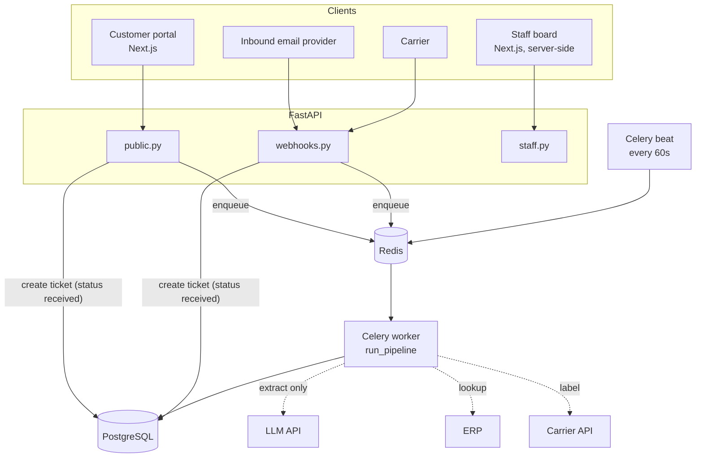
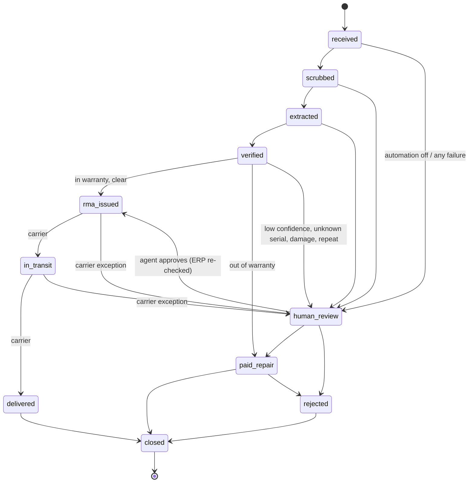
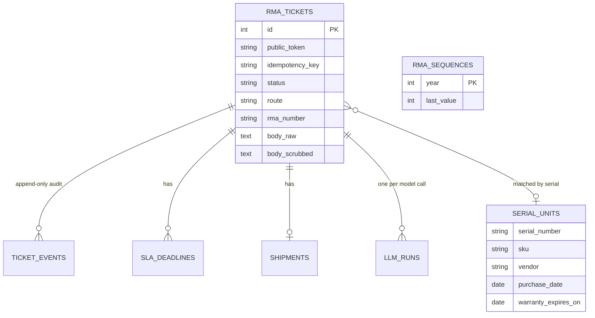
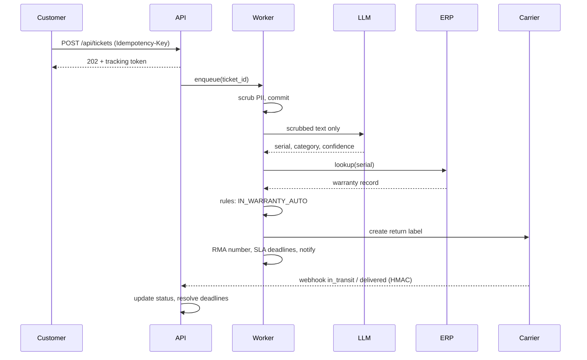

# Architecture

## Runtime view

Intake returns `202` as soon as the raw claim is stored. The pipeline runs asynchronously, so a slow model or ERP
never slows the customer down and never loses the claim.

## Ticket state machine

Enforced in `state.py`; any other move raises `InvalidTransition`.

## Data model

## Sequence: an in-warranty claim

## Why these choices

| Choice | Reason |
|--------|--------|
| PostgreSQL | Claims are relational and transactional; JSON columns hold model output and event detail |
| Celery + Redis | Retries, acks-late delivery and a scheduler for SLA scans, with a familiar operational model |
| Persisted SLA deadlines | Survive restarts and deploys; auditable; scanned by one idempotent job |
| Rules engine separate from the LLM | Explainable decisions, testable as a pure function, no model in the money path |
| Append-only event table | One source of truth for "who or what did this and why" |
